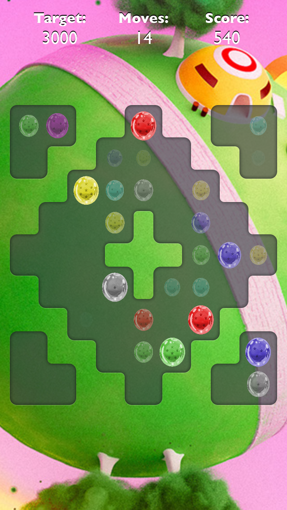
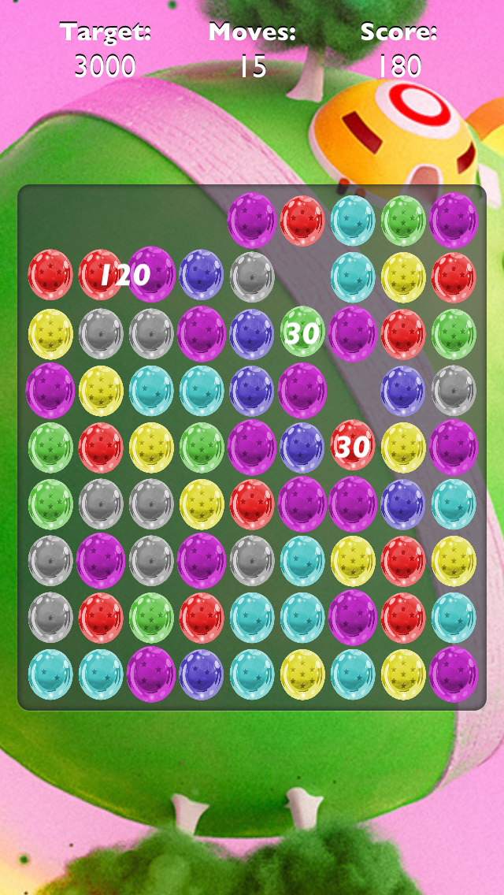
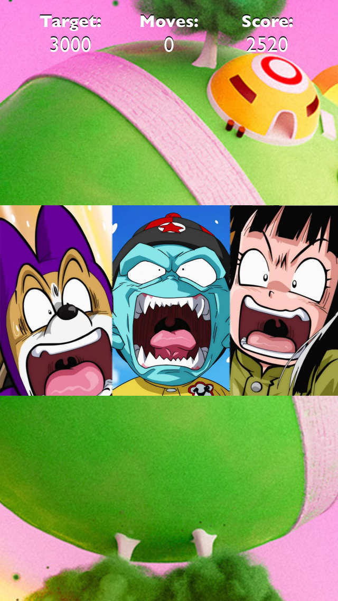

# DragonCrush

The goal is to achieve the minimum points in a given moves number.

Just swap the dragon balls to make as long chains as possible to get more points and bonuses.

If you do not achieve the level goal than you have to repeat the level.

